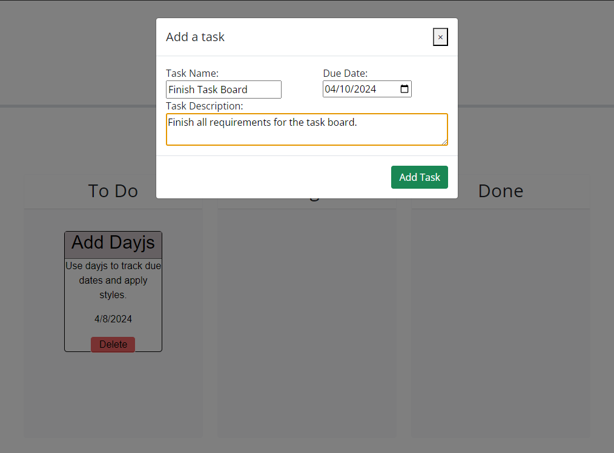
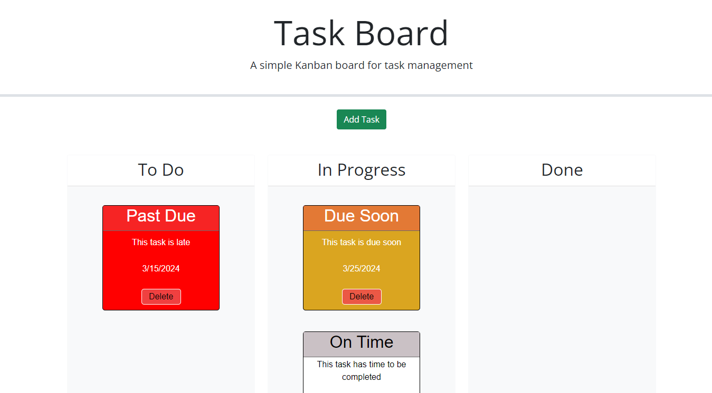

# Task Board

## Description
This task board allows you to add tasks, track their status, and remove tasks that have been finished or are no longer relavent. Tasks will be color coded based on the current date in relation to the given due date. Being able to track tasks will give you a visual representation of things that need done, while offering an easy way to manipulate the status of the tasks. All tasks will be saved in localStorage allowing them to be saved between sessions on the browser.

## Installation

No installation is required. To access the task board click <a href='https://aranosbanazir.github.io/task-board/'>here</a>.

## Usage
To use the task board simply click on the green add task button. A modal form will pop up allowing you to enter the information for your task as displayed below.

After adding your tasks they will be dropped into the 'To Do' lane. You can then drag the tasks from lane to lane to track their status. 

When dragged to the 'Done' lane all tasks will display with the same styling as the depicted 'On Time' task.

To delete a task hit the delete button on the individual task, this will remove the task from localStorage, and clear it from your task board.